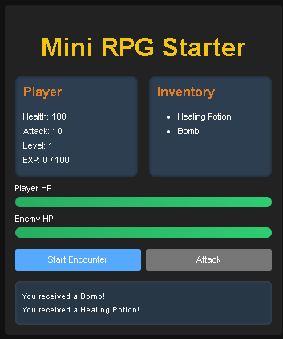
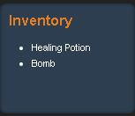
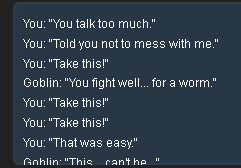
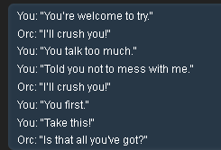
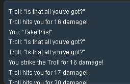
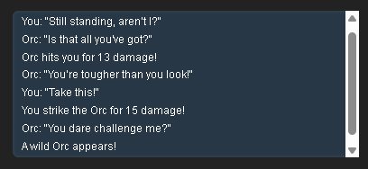
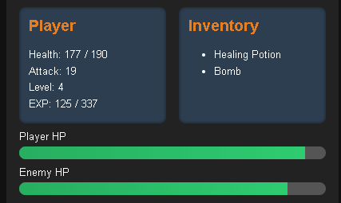

<h1>Mini RPG Starter</h1>

Basic mini rpg game for the thrill of it, cause I used to love them.

I wish I added some images and cooler designs but I was too lazy and just used CSS lol.

Anyway the website bugged at least 10 times during production.

Might add bosses soon as well as actual images cause it's all text, and 
design to make it look less ugly.

<h2>Enemies:</h2>

·Goblin (❤️80 HP, ⚔️5-12 dmg)

·Orc (❤️120 HP, ⚔️10-18 dmg)

·Troll (❤️150 HP, ⚔️15-25 dmg)

<h2>Features:</h2>

·Inventory (🧪Healing Potion, 💣Bomb)

·Leveling (Gaining at least ❤️+20 HP as well as ⚔️+3 DMG per level)

·Mobs/enemies 🧟

·Dialogue 🗣️

·HP and DMG stats for both Player/Enemy. ❤️⚔️

